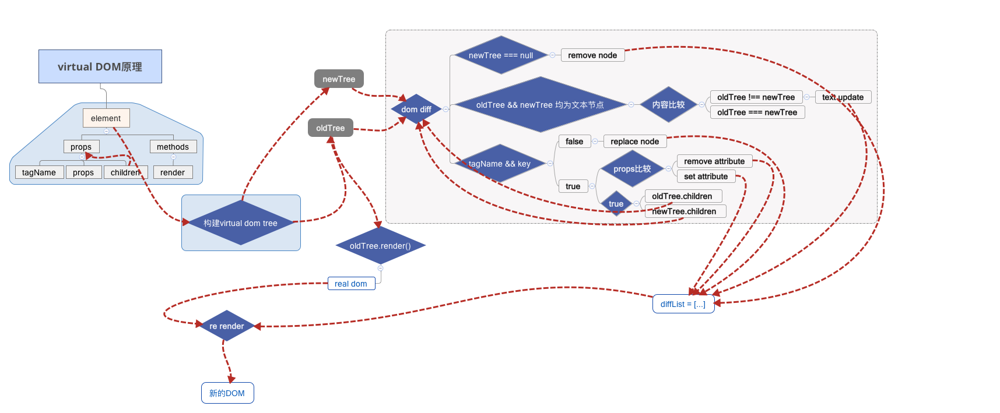

# 虚拟DOM



这张图描述了虚拟DOM的大致工作过程。（PS：我画不出这么好看的图）。

## 原理

**虚拟DOM就是将页面的 DOM 树的信息使用 JavaScript 对象来表示。**

```js
var VD = {}
```

## 结构

react的虚拟DOM树结构：

```js
var ReactElement = {
    $$typeof: REACT_ELEMENT_TYPE,
    type: type, // tagName
    key: key,
    ref: ref,
    props: {
        children: ReactElement || [ ReactElement... ],
        ...
    },
    _owner: owner
};
```

## 创建

`createElement` 是React提供的一个创建虚拟DOM的方法。它接收三个参数`type`、 `config`以及`children`，并且返回一个`element`( 虚拟DOM )。

```js
// src/isomorphic/React.js
React.createElement = function(type, config, children){

    var props = {};
    var key = null;
    var ref = null;
    var self = null;
    var source = null;

    //从config中取出key、ref、self、source以及props的各个键值

    return ReactElement
};
```

但是你会发现通过`createElement`来创建虚拟DOM的这种行为在我们现实应用中并不常见，那是因为react提供了一种更为便利的语法——`JSX`。

**所以，使用jsx并不是必须的，但它是最省力的。**


## diff 算法

```js
/**
 * Given a `prevElement` and `nextElement`, determines if the existing
 * instance should be updated as opposed to being destroyed or replaced by a new
 * instance. Both arguments are elements. This ensures that this logic can
 * operate on stateless trees without any backing instance.
 *
 * @param {?object} prevElement
 * @param {?object} nextElement
 * @return {boolean} True if the existing instance should be updated.
 * @protected
 */
function shouldUpdateReactComponent(prevElement, nextElement) {
    // 有一个节点为 null, 比较俩者是否全等。
    var prevEmpty = prevElement === null || prevElement === false;
    var nextEmpty = nextElement === null || nextElement === false;
    if (prevEmpty || nextEmpty) {
        return prevEmpty === nextEmpty;
    }

    var prevType = typeof prevElement;
    var nextType = typeof nextElement;

    if (prevType === "string" || prevType === "number") {
        return nextType === "string" || nextType === "number";
    } else {
        return (
            nextType === "object" &&
            prevElement.type === nextElement.type &&
            prevElement.key === nextElement.key
        );
    }
}
```

算法的具体过程：

1. 有一个节点为 `null/false`, 比较俩者是否全等。
2. 前一个节点为 `string/number` 类型，判断新节点是否为 `string/number` 类型。
3. 俩个节点都为 `object` 类型，比较 `type(tagName)` 和 `key`是否相等。


react会根据Diff结果进行操作：
- 结果为true

    更新旧组件
- 结果为false

    销毁旧组件重新生成新组件挂载。


总结一下更新组件的情况：
1. 俩个节点都为 `null/false`
2. 俩个节点都为 `string/number` 类型
3. 俩个节点都为 `object` 类型且它们的`type(tagName)` 和 `key`相等


## 优劣

1. 优点：
    - 直接使用js对象，处理速度比直接操作DOM快；
    - Diff算法，实现了最小化更新（高效地渲染），性能更优；
    - 对DOM做了一层抽象，可以更方便地移植到其他平台（比如：react-native）
2. 缺点：
    - 首次渲染大量DOM时，由于多了一层虚拟DOM的计算，会比innerHTML插入慢。