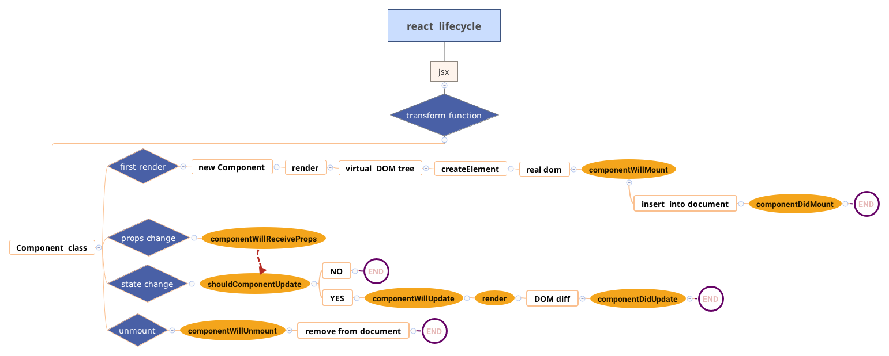

# 生命周期

<!-- TOC -->

- [生命周期](#生命周期)
    - [基本流程](#基本流程)
    - [内部实现](#内部实现)
        - [mountComponent](#mountcomponent)
        - [updateComponent](#updatecomponent)
        - [unmountComponent](#unmountcomponent)

<!-- /TOC -->

## 基本流程



如图，可以把组件生命周期大致分为三个阶段：

1. 初始化
    * componentWillMount
    * render
    * componentDidMount
2. 存在期
    * componentWillReceiveProps
    * shouldComponentUpdate
    * componentWillUpdate
    * render
    * componentDidUpdate
3. 销毁期
    * componentWillUnmount

## 内部实现

在 react 中主要通过三个函数来实现组件的生命周期：`mountComponent`、`updateComponent`、`unmountComponent`，它们分别管理着组件的初始化、存在期和销毁期。

### mountComponent

`mountComponent` 主要负责生命周期中的初始化。

1. 初始化组件
2. 渲染 html
3. 注册事件

```js
//src/renderers/shared/stack/reconciler/ReactCompositeComponent.js
/**
 * Initializes the component, renders markup, and registers event listeners.
 *
 * @param {ReactReconcileTransaction|ReactServerRenderingTransaction} transaction
 * @param {?object} hostParent
 * @param {?object} hostContainerInfo
 * @param {?object} context
 * @return {?string} Rendered markup to be inserted into the DOM.
 * @final
 * @internal
 */
mountComponent: function(transaction, hostParent, hostContainerInfo, context) {
    this._context = context;
    this._mountOrder = nextMountID++;
    this._hostParent = hostParent;
    this._hostContainerInfo = hostContainerInfo;

    var publicProps = this._currentElement.props;
    var publicContext = this._processContext(context);

    var Component = this._currentElement.type;

    var updateQueue = transaction.getUpdateQueue();

    // Initialize the public class
    var doConstruct = shouldConstruct(Component);
    var inst = this._constructComponent(
        doConstruct,
        publicProps,
        publicContext,
        updateQueue
    );
    var renderedElement;

    // Support functional components
    if (!doConstruct && (inst == null || inst.render == null)) {
        renderedElement = inst;
        inst = new StatelessComponent(Component);
        this._compositeType = CompositeTypes.StatelessFunctional;
    } else {
        if (isPureComponent(Component)) {
            this._compositeType = CompositeTypes.PureClass;
        } else {
            this._compositeType = CompositeTypes.ImpureClass;
        }
    }

    // These should be set up in the constructor, but as a convenience for
    // simpler class abstractions, we set them up after the fact.
    inst.props = publicProps;
    inst.context = publicContext;
    inst.refs = emptyObject;
    inst.updater = updateQueue;

    this._instance = inst;

    // Store a reference from the instance back to the internal representation
    //存储的实例的引用
    ReactInstanceMap.set(inst, this);

    var initialState = inst.state;
    if (initialState === undefined) {
        inst.state = initialState = null;
    }

    this._pendingStateQueue = null;
    this._pendingReplaceState = false;
    this._pendingForceUpdate = false;

    var markup;
    if (inst.unstable_handleError) {
        //performInitialMountWithErrorHandling只是在performInitialMount的基础上多了一层错误处理，这里不做展开，感兴趣可以自己看源码。
        markup = this.performInitialMountWithErrorHandling(
            renderedElement,
            hostParent,
            hostContainerInfo,
            transaction,
            context
        );
    } else {
        markup = this.performInitialMount(
            renderedElement,
            hostParent,
            hostContainerInfo,
            transaction,
            context
        );
    }

    if (inst.componentDidMount) {
        // 调用componentDidMount
        transaction.getReactMountReady().enqueue(inst.componentDidMount, inst);
    }

    return markup;
};
```

```js
performInitialMount: function(
    renderedElement,
    hostParent,
    hostContainerInfo,
    transaction,
    context
) {
    var inst = this._instance;

    var debugID = 0;

    if (inst.componentWillMount) {
        // 调用生命周期函数
        inst.componentWillMount();
        // When mounting, calls to `setState` by `componentWillMount` will set
        // `this._pendingStateQueue` without triggering a re-render.
        if (this._pendingStateQueue) {
            inst.state = this._processPendingState(
                inst.props,
                inst.context
            );
        }
    }

    // If not a stateless component, we now render
    if (renderedElement === undefined) {
        renderedElement = this._renderValidatedComponent();
    }

    var nodeType = ReactNodeTypes.getType(renderedElement);
    this._renderedNodeType = nodeType;
    var child = this._instantiateReactComponent(
        renderedElement,
        nodeType !== ReactNodeTypes.EMPTY /* shouldHaveDebugID */
    );
    this._renderedComponent = child;

    var markup = ReactReconciler.mountComponent(
        child,
        transaction,
        hostParent,
        hostContainerInfo,
        this._processChildContext(context),
        debugID
    );

    return markup;
}
```

### updateComponent

componentWillReceiveProps

shouldComponentUpdate

componentWillUpdate

render

componentDidUpdate

对已经挂载的组件执行更新，调用其他存在期生命周期函数，更新DOM

```js
/**
 * @param {ReactReconcileTransaction} transaction
 * @param {ReactElement} prevParentElement
 * @param {ReactElement} nextParentElement
 * @internal
 * @overridable
 */
updateComponent: function(
    transaction,
    prevParentElement,
    nextParentElement,
    prevUnmaskedContext,
    nextUnmaskedContext
) {
    var inst = this._instance;

    var willReceive = false;
    var nextContext;

    // 判断context是否已经改变
    if (this._context === nextUnmaskedContext) {
        nextContext = inst.context;
    } else {
        nextContext = this._processContext(nextUnmaskedContext);
        willReceive = true;
    }

    var prevProps = prevParentElement.props;
    var nextProps = nextParentElement.props;

    // 不是简单的state更新，而是props更新
    if (prevParentElement !== nextParentElement) {
        willReceive = true;
    }

    // An update here will schedule an update but immediately set
    // _pendingStateQueue which will ensure that any state updates gets
    // immediately reconciled instead of waiting for the next batch.

    // 调用生命周期函数
    if (willReceive && inst.componentWillReceiveProps) {
        inst.componentWillReceiveProps(nextProps, nextContext);
    }

    var nextState = this._processPendingState(nextProps, nextContext);
    var shouldUpdate = true;

    if (!this._pendingForceUpdate) {
        if (inst.shouldComponentUpdate) {
            // 调用生命周期函数
            shouldUpdate = inst.shouldComponentUpdate(
                nextProps,
                nextState,
                nextContext
            );
        } else {
            if (this._compositeType === CompositeTypes.PureClass) {
                shouldUpdate =
                    !shallowEqual(prevProps, nextProps) ||
                    !shallowEqual(inst.state, nextState);
            }
        }
    }

    this._updateBatchNumber = null;
    if (shouldUpdate) {
        this._pendingForceUpdate = false;
        // Will set `this.props`, `this.state` and `this.context`.
        this._performComponentUpdate(
            nextParentElement,
            nextProps,
            nextState,
            nextContext,
            transaction,
            nextUnmaskedContext
        );
    } else {
        // If it's determined that a component should not update, we still want
        // to set props and state but we shortcut the rest of the update.
        this._currentElement = nextParentElement;
        this._context = nextUnmaskedContext;
        inst.props = nextProps;
        inst.state = nextState;
        inst.context = nextContext;
    }
}
```

```js
/**
 * Merges new props and state, notifies delegate methods of update and
 * performs update.
 *
 * @param {ReactElement} nextElement Next element
 * @param {object} nextProps Next public object to set as properties.
 * @param {?object} nextState Next object to set as state.
 * @param {?object} nextContext Next public object to set as context.
 * @param {ReactReconcileTransaction} transaction
 * @param {?object} unmaskedContext
 * @private
 */
_performComponentUpdate: function(
    nextElement,
    nextProps,
    nextState,
    nextContext,
    transaction,
    unmaskedContext
) {
    var inst = this._instance;

    var hasComponentDidUpdate = Boolean(inst.componentDidUpdate);
    var prevProps;
    var prevState;
    var prevContext;
    if (hasComponentDidUpdate) {
        prevProps = inst.props;
        prevState = inst.state;
        prevContext = inst.context;
    }

    if (inst.componentWillUpdate) {
        // 调用生命周期函数
        inst.componentWillUpdate(nextProps, nextState, nextContext);
    }

    this._currentElement = nextElement;
    this._context = unmaskedContext;
    inst.props = nextProps;
    inst.state = nextState;
    inst.context = nextContext;

    // 此处会调用render
    this._updateRenderedComponent(transaction, unmaskedContext);

    if (hasComponentDidUpdate) {
        transaction
            .getReactMountReady()
            .enqueue(
                // 调用生命周期函数
                inst.componentDidUpdate.bind(
                    inst,
                    prevProps,
                    prevState,
                    prevContext
                ),
                inst
            );
    }
}
```

### unmountComponent

1. 执行 componentWillUnmount
2. 从 refs 中移除
3. 组件实例从虚拟 DOM 中移除
4. 清空当前组件下所有队列（state，callback...）

```js
/**
 * Releases any resources allocated by `mountComponent`.
 *
 * @final
 * @internal
 */
unmountComponent: function(safely) {
    if (!this._renderedComponent) {
        return;
    }

    var inst = this._instance;

    if (inst.componentWillUnmount && !inst._calledComponentWillUnmount) {
        inst._calledComponentWillUnmount = true;

        if (safely) {
            var name = this.getName() + ".componentWillUnmount()";
            ReactErrorUtils.invokeGuardedCallback(
                name,
                inst.componentWillUnmount.bind(inst)
            );
        } else {
            inst.componentWillUnmount();
        }
    }

    if (this._renderedComponent) {
        ReactReconciler.unmountComponent(this._renderedComponent, safely);
        this._renderedNodeType = null;
        this._renderedComponent = null;
        this._instance = null;
    }

    // Reset pending fields
    // Even if this component is scheduled for another update in ReactUpdates,
    // it would still be ignored because these fields are reset.
    this._pendingStateQueue = null;
    this._pendingReplaceState = false;
    this._pendingForceUpdate = false;
    this._pendingCallbacks = null;
    this._pendingElement = null;

    // These fields do not really need to be reset since this object is no
    // longer accessible.
    this._context = null;
    this._rootNodeID = 0;
    this._topLevelWrapper = null;

    // Delete the reference from the instance to this internal representation
    // which allow the internals to be properly cleaned up even if the user
    // leaks a reference to the public instance.
    ReactInstanceMap.remove(inst);
}
```
